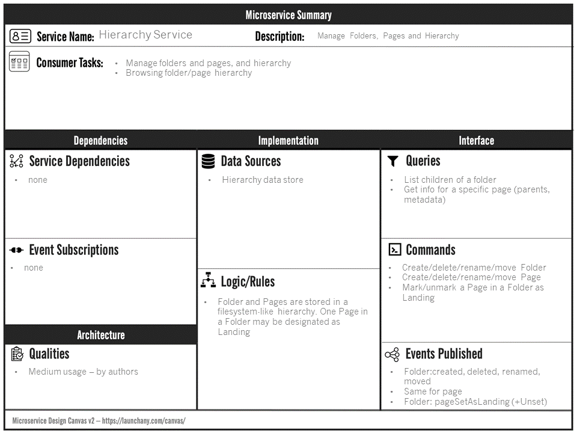
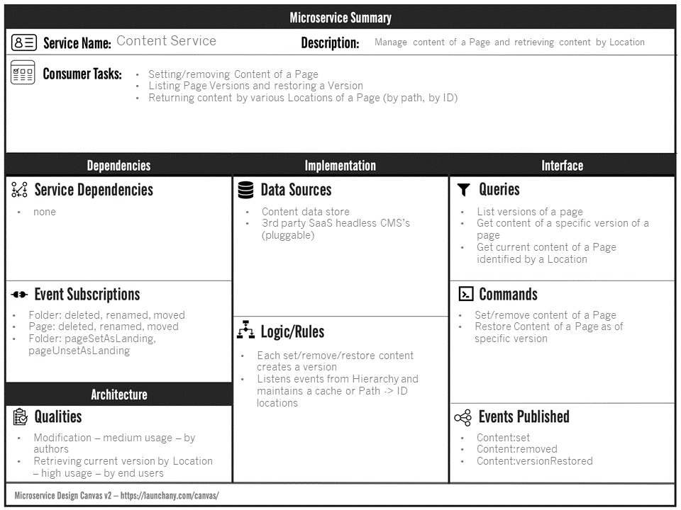
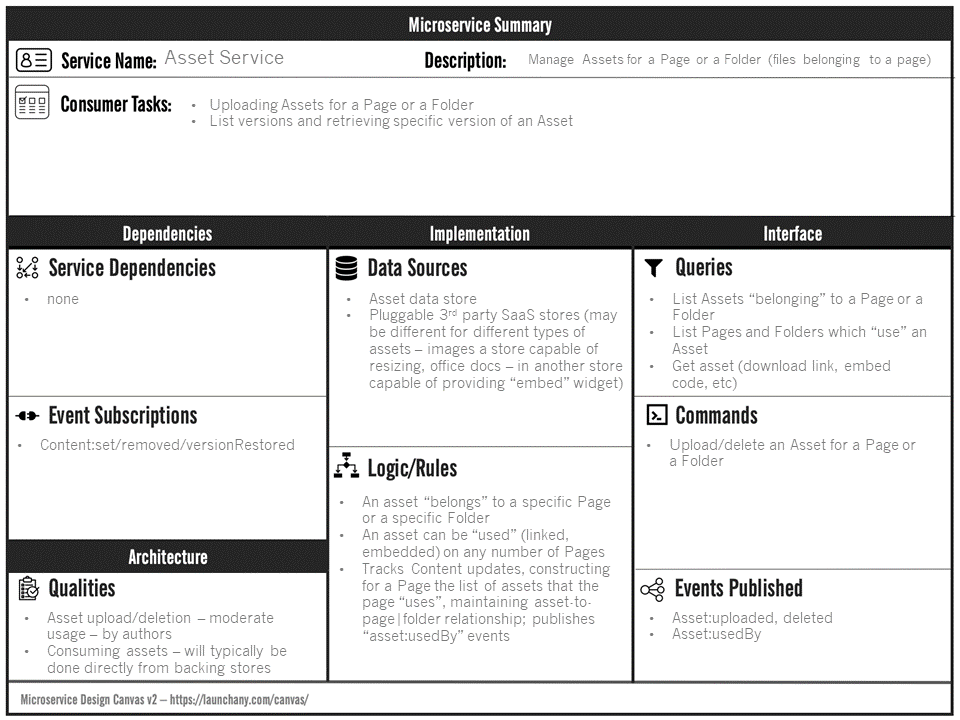
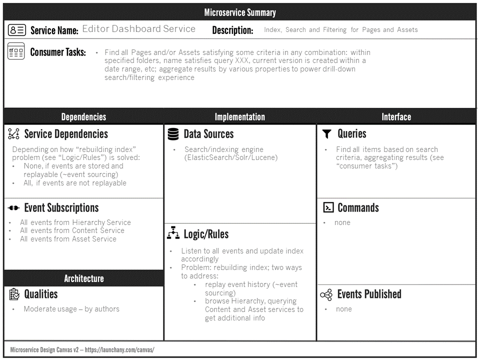

# Web Content and Asset management

## Domain description

Editors create pages, and arrange them in a tree hierarchy. Nodes of the tree are Folders and 
Pages. One Page in a Folder may be designated as Landing.

Editors set and delete Content for a page (JSON). Content is versioned: each setContent/deleteContent creates a 
Version in Version History. Editors may restore any Version in Version History (this creates a new Version).

End Users (via client applications) consume Content. When retrieving Content, end users identify pages using
Locations. A Location can be Page's ID or a Path in the Hierarchy (in the future custom human-friendly identifiers could
be assigned for Pages).

Pages may use Assets - images, office documents, etc.
An Asset always "belongs" to some node in the Hierarchy - a Folder or a Page.
A Page "uses" assets: e.g. a download link may be inserted into a paragraph on a page, or an image of an Office document
can be *embedded* into content of a Page. A given asset can be "used" on any Page - including Pages to which the
asset doesn't "belong".

Editors have access to Editor Dashboard, which facilitates efficient navigation experience by supporting a filtering/search
experience. While browsing, editors are effectively executing search requests like. For example, find all Pages and Assets
within these specified parent folders, such that their current version is created within a date range;
calculate aggregations (e.g. how many Pages found, how many Assets, who are top modifiers, etc).

## Suggested Breakdown of Microservices

* **Hierarchy Service** manages Hierarchy of Folders and Pages
* **Content Service** manages Content and Versioning of Pages; retrieves Content by Location (maintains mapping of
  Path -> PageID to streamline retrieval of Content by Path)
* **Asset Service** manages Assets belonging to "Pages" and "Folders"; maintains relationship between Pages and Assets
  by tracking which Asset is "used" by which Page
* **Editor Dashboard Service** powers the search/filtering-based browsing experience for Editors by maintaining a search index

### Hierarchy Service

[API documentation](https://audintsev.github.io/otus-architect-content-mgmt/?urls.primaryName=Hierarchy%20Service)

### Content Service

[API documentation](https://audintsev.github.io/otus-architect-content-mgmt/?urls.primaryName=Content%20Service)

### Asset Service

[API documentation](https://audintsev.github.io/otus-architect-content-mgmt/?urls.primaryName=Asset%20Service)

### Editor Dashboard Service

[API documentation](https://audintsev.github.io/otus-architect-content-mgmt/?urls.primaryName=Editor%20Dashboard%20Service)
